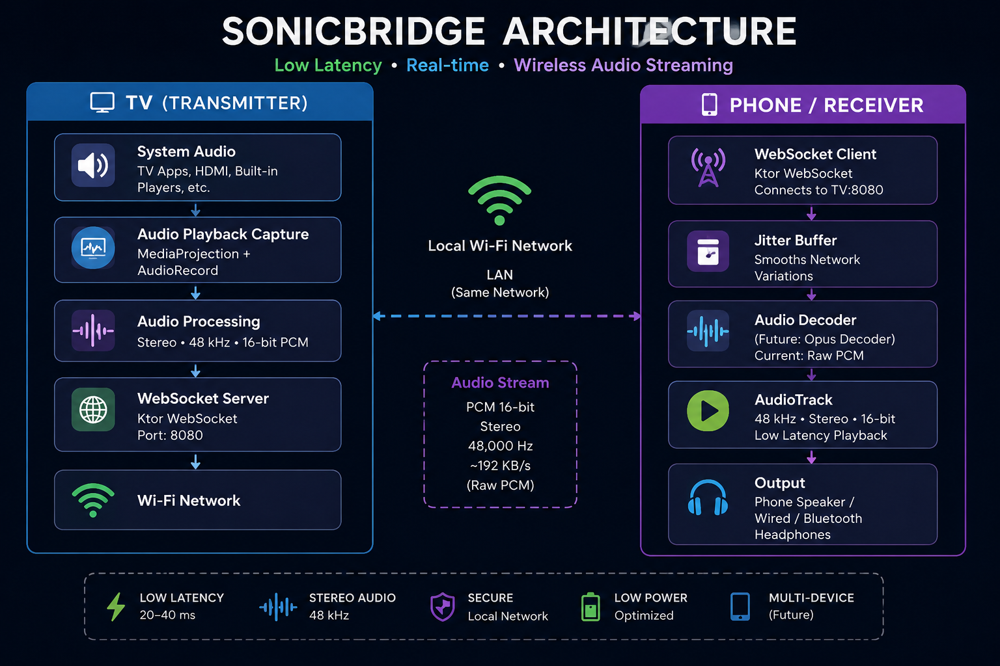

# 📺 Sound Transmitter TV

> Transform your Android TV into a low-latency wireless audio transmitter.

**Sound Transmitter TV** captures system audio directly from your Android TV using Android's **Audio Playback Capture API** and streams it over Wi-Fi in real time to another device.

Perfect for watching TV privately with headphones connected to your phone, reducing audio delay compared to Bluetooth, or building custom wireless audio solutions.

---

## ✨ Features

* 🎵 Real-time TV audio streaming
* 🎧 Stereo PCM (16-bit)
* ⚡ Low latency streaming
* 📡 Built-in WebSocket server
* 📺 Android TV optimized UI (Jetpack Compose for TV)
* 🔊 Captures system audio using MediaProjection
* 🚀 Lightweight foreground service
* 🌐 Works entirely over your local Wi-Fi network

---

## 📸 Overview

```
Android TV
     │
     ▼
Audio Playback Capture
     │
     ▼
WebSocket Server
     │
══════════ Wi-Fi ══════════
     │
     ▼
Browser / Android Receiver
     │
     ▼
Headphones / Speakers
```

---

## 🛠 Tech Stack

* Kotlin
* Jetpack Compose for TV
* Ktor WebSocket Server
* AudioPlaybackCapture API
* MediaProjection API
* AudioRecord
* Coroutines
* Material 3 TV

---

## 📦 Requirements

* Android TV (Android 10 / API 29 or above)
* Local Wi-Fi Network
* Browser or Android Receiver connected to the same network

---

## 🚀 Getting Started

### 1. Clone the repository

```bash
git clone https://github.com/noncoderf/Wifi-Sound-Transmitter-TV-App.git
```

### 2. Open with Android Studio

Use the latest stable version of Android Studio.

### 3. Run on Android TV

Install the application on your Android TV device.

### 4. Start Streaming

Press **Start Transmitting**.

Grant the required MediaProjection permission.

The TV will begin capturing playback audio.

---

## 🌐 WebSocket Endpoint

```
ws://<TV-IP>:8080/audio
```

Example

```
ws://192.168.1.16:8080/audio
```

Binary frames contain raw PCM audio.

---

## 🎼 Audio Format

| Property    | Value      |
| ----------- | ---------- |
| Sample Rate | 48,000 Hz  |
| Channels    | Stereo     |
| Encoding    | PCM 16-bit |
| Transport   | WebSocket  |

---

## 📱 Planned Android Receiver

An Android companion application is currently under development.

Features planned:

* Automatic TV discovery
* Low latency AudioTrack playback
* Auto reconnect
* Background playback
* Bluetooth headset support
* Connection quality indicator
* Latency statistics

---

## 🚀 Future Roadmap

* ✅ Android Receiver App
* ✅ Automatic TV Discovery (mDNS)
* ✅ Multiple Receiver Support
* ⏳ Opus Audio Codec
* ⏳ Adaptive Jitter Buffer
* ⏳ AES Encrypted Streaming
* ⏳ Lip Sync Calibration
* ⏳ Volume Synchronization
* ⏳ Multi-room Audio

---

## 📈 Current Status

| Feature                | Status     |
| ---------------------- | ---------- |
| Audio Playback Capture | ✅          |
| Real-time Streaming    | ✅          |
| Stereo Audio           | ✅          |
| Low Latency            | ✅          |
| Browser Receiver       | ✅          |
| Android Receiver       | 🚧         |
| Opus Compression       | 📅 Planned |

---

## ⚠ Limitations

* Requires Android 10+ for Audio Playback Capture.
* Some applications may prevent playback capture for security reasons.
* Both devices must be connected to the same Wi-Fi network.

---

## 🤝 Contributing

Contributions, feature requests, and bug reports are always welcome.

Feel free to open an issue or submit a pull request.

---

## 📄 License

This project is licensed under the MIT License.

---

## 👨‍💻 Author

**Nizamuddin Ahmed**

Senior Android Developer

* GitHub: https://github.com/noncoderf
* LinkedIn: https://linkedin.com/in/nizamuddin007

---

⭐ If you found this project interesting, consider giving it a star!
